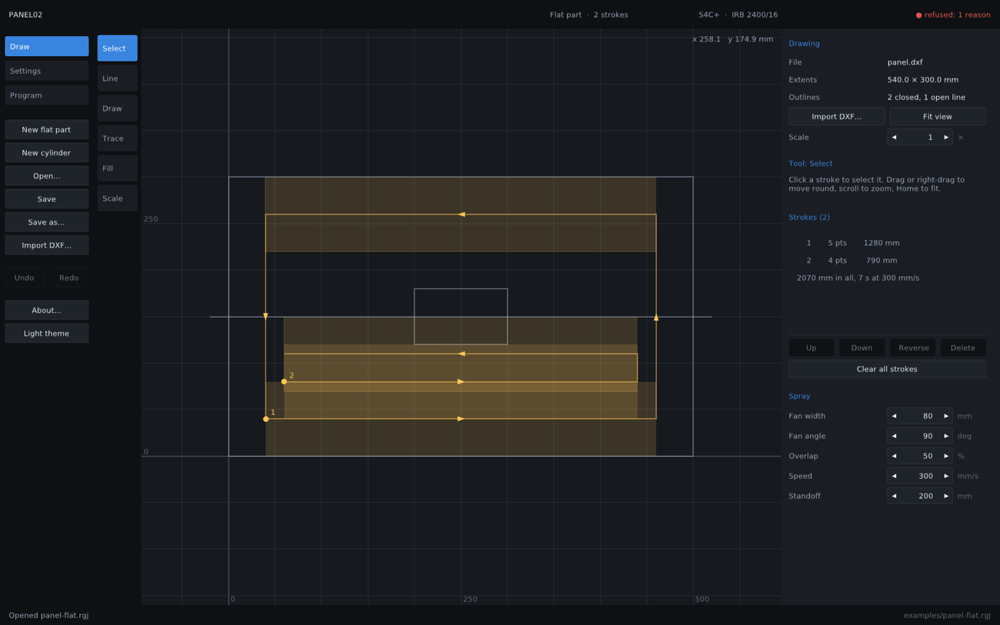

# rapidgen

**ABB S4 spray program generator** — plain C99 and SDL2, Linux and Windows.

rapidgen writes RAPID programs for an ABB IRB 2400 on an S4, S4C or S4C+
controller. It sprays two kinds of part:

- **A flat part.** Import its DXF, scale it to a known dimension, and paint
  the pattern the gun should follow over the drawing — by hand, by tracing an
  outline, or by filling a region with passes. Good for complex tool paths
  that are easier to draw than to describe.
- **A cylinder** standing on a rotator that turns continuously and
  independently of the robot. You give the bands of the part to coat, in the
  job file or as a DXF of the unrolled surface.

Either way, rapidgen works out the motion, follows every move through the
robot's kinematics, and then writes the program or refuses it with the reason
and how far off it was.



> **Status.** Tested against its own unit tests (ASan + UBSan), and the editor
> has been driven and screenshotted under a virtual display. The Windows build
> has been run under Wine. **No generated program has been loaded onto an S4
> controller, simulated, or run on a robot.** The program file format and the
> IRB 2400 kinematics conventions have not been checked against a real
> controller. Read *What has and has not been proven* before you load
> anything.

## The editor

`rapidgen` with no arguments opens the last job. Three pages:

**Draw** — the part's drawing with the pattern over it. Each stroke is drawn
as a translucent band as wide as the spray fan, which is what will actually be
coated, with its number at the start and arrows along it: the order and the
direction are the program. Tools:

| Tool | Key | What it does |
|---|---|---|
| Select | S | Pick a stroke; drag to move round, scroll to zoom, Home to fit |
| Line | L | Click points; they snap to the drawing's corners and lines (Shift to place one freely). Double-click or Enter finishes, Backspace takes one back, Escape cancels |
| Draw | D | Freehand; thinned to the points that matter when you let go |
| Trace | T | Click near an outline: once round it from that point, inset by the amount set |
| Fill | F | Click inside an outline: parallel passes a fan width less the overlap apart, previewed as you hover |
| Scale | M | Click two points a known distance apart, then type the true distance |

Delete removes the selected stroke, R reverses it, and the stroke list
reorders them — the order is the order they are sprayed.

**Settings** — every value the job file holds, with a note on each saying what
it does.

**Program** — the checks run a moment after the job stops changing. The page
says what was refused and why, and shows the report and the program itself
before `Write program` puts `NAME.PRG` and `NAME.txt` beside the job file.

## The command line

```sh
rapidgen JOB.rgj                # write the program and its report beside the job
rapidgen JOB.rgj --check        # plan and check only, print the report
rapidgen --template [flat]      # a commented job file to start from
rapidgen --fk irb2400_16 J1..J6 # kinematics, for checking against the pendant
rapidgen --robots | --controllers
```

Exit status: `0` written, `1` bad input, `2` refused (the report says why).
`make example` runs the three jobs in `examples/`.

## How each part is sprayed

**Flat.** The gun points along the plane's normal at the standoff and follows
each stroke at the spray speed, stopping on its last point. It lifts by the
approach distance between strokes. More than one stroke needs `gun_signal`,
because the gun has to be off in between; sharp corners are counted and
reported, since the robot slows through each one and the coat builds up.

The fan is a wide slot, and the gun does not turn during a program: `fan_along`
says which way the fan's long axis lies in the drawing, and **a stroke has to
run across the fan** to lay down a band its full width. A stroke running along
the fan paints a narrow line instead, which the canvas shows as a thin band and
the report warns about, with how much of the painted length is affected. Fill
passes should therefore run across `fan_along` — the defaults (fan at 90°,
passes at 0°) already do.

**Cylinder.** The part turns continuously, so the robot cannot know its angle
and only full bands round it can be sprayed. Each turn advances the spray by
the pitch: `fan width × (1 − overlap)`, and the traverse speed follows,
`pitch × rpm / 60`. The gun turns round `fan/2 + run-up` past each band edge
so the edge gets its full number of passes. A DXF region that does not wrap
the full circumference, or a hole in one, is refused rather than coated wrong.

## Job files

A job is plain text, one `key = value` per line (`rapidgen --template` lists
every key). Unknown keys are errors, so a typo cannot silently fall back to a
default. The job is the only input: programs are regenerated from it, never
edited by hand, and the editor writes the same format it reads. It is also
what a request in plain English turns into — something a person can read and
correct before anything is generated.

Coordinates:

| Frame | Origin | Axes |
|---|---|---|
| robot base | the robot's foot | ABB base frame: X forward, Z up |
| cylinder (`wRgCylinder`) | rotator axis at table height | Z up the axis, X towards the robot |
| flat part (`wRgPart`) | the drawing's origin on the surface | the drawing's X and Y, Z out of the surface |
| drawing | as drawn, × `drawing_scale` | millimetres |

The tool's Z axis is the spray direction and its X axis the long axis of the
fan. `tool_tcp` is the gun tip; rapidgen adds the standoff itself.

## Drawings

ASCII DXF, any AutoCAD version: LINE, ARC, CIRCLE, LWPOLYLINE and 2D POLYLINE
(bulge arcs included). Loose lines and arcs are joined into closed outlines,
arcs are flattened to within `chord_tolerance`, `$INSUNITS` is honoured, and
text, dimensions and points are skipped.

In the editor a drawing is read leniently: centre lines and anything else that
closes no outline are counted and shown, so a real part drawing can be traced
over. **Generating a program is strict**: SPLINE, ELLIPSE, INSERT, HATCH and
3D polylines are refused with advice (convert to polylines, explode the block,
delete the hatch), and for a cylinder every outline must close.

## What rapidgen checks

Every rule is a hard limit. A broken rule means no program, and the report
gives the place and the margin.

- **Reach.** Every point on every move, every `sample_step` mm along linear
  moves and every 2° along joint moves. A miss is reported in mm.
- **Joint limits.** No joint closer than `min_margin` to its limit.
- **Wrist singularity.** Axis 5 at least `min_wrist` from straight.
- **Flips.** No joint turning more than `max_joint_step` between samples on a
  straight move.
- **Clearance.** Wrist centre, flange and gun tip at least `clearance` from
  the part.
- **Process.** Spray speed under `max_spray_speed`; several strokes or bands
  need a gun output; bands on the part, and far enough apart that the spray
  past their edges does not meet.
- **Drawing** (cylinder): regions wrap the full circumference within
  `wrap_tolerance` and match the radius.

## What rapidgen does not check

Every report lists these too:

- the gun body and the arm's links against the part, its fixture or rotator,
  and the cell; only three points on the arm are checked
- the IRB 2400's axis 2/3 interaction limit (parallel arm)
- the controller's own corner blending, and speed near the stops
- film thickness: speed, spacing and coats set it, the spray process decides it

## What has and has not been proven

| | Status |
|---|---|
| Kinematics agree with themselves (FK→IK round trip, 2000 random poses) | tested |
| Pattern tools: thinning, snapping, tracing, filling round holes | tested |
| IRB 2400 dimensions and joint limits | from ABB product data via ROS-Industrial's `abb_irb2400_support`; **not checked on a robot** |
| Joint sign conventions, `cfx` encoding | ABB's documented convention; **not checked on an S4** |
| Program file format (`%%%` header, `.PRG`, 8.3 names, MoveAbsJ on S4C/S4C+ only) | assumed; **not loaded on any controller** |
| Coverage, overrun and speed arithmetic | tested |
| The editor's pages, tools and previews | driven under a virtual display and read back from screenshots |
| Film build and coverage on a real part | **not tested** |

Before the first program runs on a robot:

1. **Check the kinematics on the pendant.** With `tool0` and `wobj0`
   selected, jog to three or four joint positions well away from zero and
   compare the pendant's Cartesian position with
   `rapidgen --fk irb2400_16 J1 J2 J3 J4 J5 J6`. They should agree to about a
   millimetre. If a sign disagrees, stop and report it.
2. **Check the file format.** Save a program from each controller type and
   compare it with rapidgen's output. Then load a generated program and let
   the controller check its syntax, without running it.
3. **Calibrate the gun's TCP** on the pendant (4-point) and put it in
   `tool_tcp` / `tool_rot`.
4. **Simulate.** Current RobotStudio has no S4 virtual controller, so use an
   IRC5 virtual controller with an IRB 2400 and the same program body.
5. **First run** in manual reduced speed, gun off, stepping through.

## Building

```sh
make            # ./rapidgen — the editor and the command line
make test       # unit tests under ASan + UBSan (the core needs no SDL)
make run        # build and open the editor
make windows    # rapidgen.exe (mingw-w64 + tools/win/get-sdl2.sh)
make windows-dist
make appimage   # portable Linux build, glibc 2.35
```

Dependencies: SDL2 only; Nuklear is vendored in `third_party/`. The Windows
build links the UCRT, so it needs Windows 10 or 11 (Windows 7/8.1 with
KB2999226). `RAPIDGEN_SCALE=2` overrides the HiDPI scale.

## Source layout

| File | What it does |
|---|---|
| `rg_dxf` | DXF reader: entities into millimetre polylines |
| `rg_shape` | closing outlines, coverage along a line, holes, crossings, picking |
| `rg_pattern` | thinning, snapping, tracing and filling: the painting tools' geometry |
| `rg_robot` | IRB 2400 data, forward/inverse kinematics, confdata |
| `rg_job` | the job file: keys, parsing, writing, validation, frames |
| `rg_plan` | bands, strokes, moves, and every check that can refuse a plan |
| `rg_rapid` | controller dialects and the RAPID writer |
| `rg_report` | the text report |
| `rg_ui*` | the editor: shell, Draw page, other pages, dialogs |
| `rg_theme`, `rg_config` | the palette, and settings remembered between runs |
| `plat_*` | the only OS-specific code |

## Planned

- An IRC5 export alongside the S4 program, and a small RobotStudio add-in, so
  simulation is one step.
- Curved parts from a 3D surface, not just flat ones and cylinders.
- A stopped-rotator mode that rasters a full DXF shape across the reachable
  arc, for cylinders indexed by hand.
- An IRB 2400L profile, once its dimensions are checked against ABB's data
  sheet.
- Turning the gun as it goes, so the fan stays across the direction of travel
  on a path that changes direction (today the fan keeps one angle for the
  whole program, and strokes that run along it are warned about).

## Licence

GPL-3.0-or-later. Copyright (C) 2026 Hugh Frater. See `LICENSE`.
